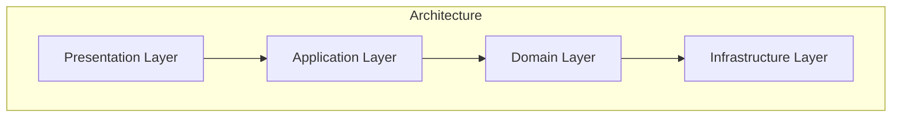

# VCMAppPasha

## Overview
This project is a Vacancy Management Application developed as part of a task for Pasha Insurance. The application facilitates the full lifecycle of vacancy management, including guest-side and admin-side functionalities.

`P.S. Not all features have been implemented; only the minimal requirements specified by Pasha Insurance have been completed.`

### Guest-Side Features:
Vacancy Application: Users can browse and apply for vacancies.
Online Exam: After applying, users take an online exam to assess their suitability.
CV Submission: Users upload their CVs as part of the application process.

### Admin-Side Features:
Dashboard: Provides an overview of vacancies, applications, and exams.
Exam Results Management: Admins can view exam results, including detailed answers for each candidate.

### Architecture

The application follows the Clean Architecture principles, ensuring:

Separation of concerns.
Testability and maintainability.
Scalability for future enhancements.

Layers:
1. Presentation Layer: Handles UI and user interactions.
2. Application Layer: Contains use cases and business logic.
3. Domain Layer: Defines core domain models (anemic models) and business rules.
4. Infrastructure Layer: Manages data access, external APIs, and persistence.

#### Domain Models
The project uses lightweight anemic domain models to keep the domain logic simple and delegate complex operations to the application layer.

### Technology Stack
Backend: ASP.NET Core
Frontend: Razor Pages
Database: SQL Server
ORM: EntityFramework Core

## Getting Started
1. Clone the repository:
  `git clone https://github.com/rasulhsn/VCMAppPasha.git`
2. Navigate to the project directory:
  `cd VCMAppPasha`
3. Set up the database connection string in the configuration file (appsettings.json).
4. Run the application:
  `dotnet run`
